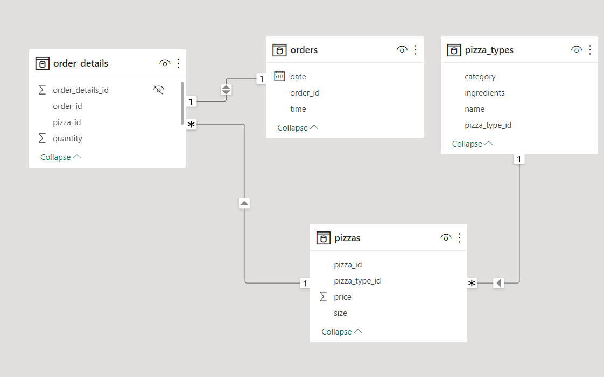
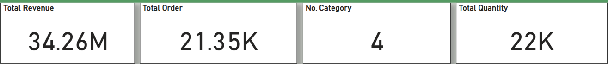
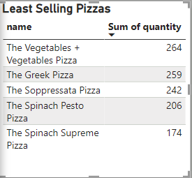
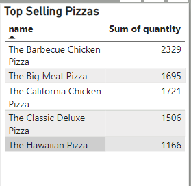
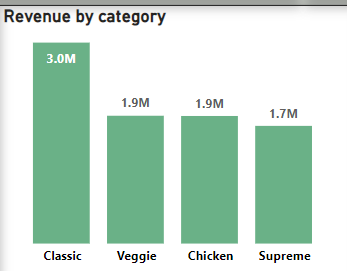
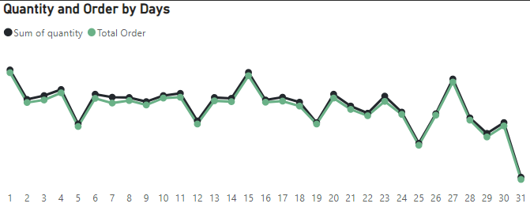

# Pizza-Sales-Dataset

## Introduction

This is an imaginary dataset on sales of Pizzas. This is to pratice my skills in Power BI using power query, data modelling and DAX

## Problem Statement
The following insights were derived from the analysis
1. Total Revenue
2. Total Orders
3. Number of Pizza Category
4. Total Quantity
5. Revenue by Category
6. Best selling Pizza (Top 5) 
7. Least Selling Pizza (Bottom 5)
8. Revenue trend by Day of the Week
9. Orders and Quantities by Day of the week
10. Quantity sold by Pizza size

## Data Tranformation and Cleaning
The data was presented in four excel tables
1. order_details
2. orders
3. Pizzas
4. Pizza_type
The data was transformed and cleaned in power query before loading into power BI. Data cleaning was perfromed per table where duplicates were removed, Null values replaced and columns and data were renamed as needed

## Data Model Design
The data required for this analysis are located in various tables. Therfore, appropriate modelling is required. A star schema was used to create connections between the tables.

## Data Aanalysis/ Visualization
View dashboard [here](https://app.powerbi.com/groups/me/reports/c17c5e66-377b-4055-b88b-fcde1dd6a10b/ReportSection?experience=power-bi)

DAX was used to derive the total revenue and total order

